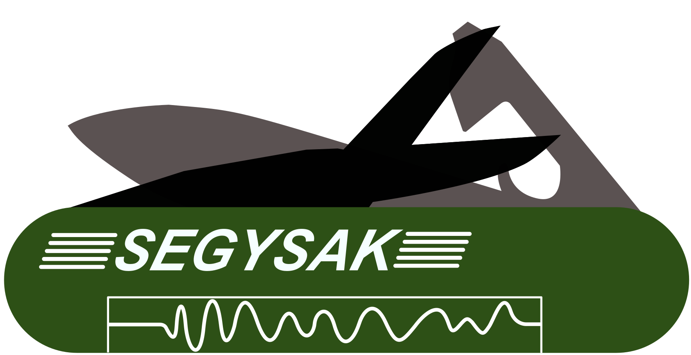

# SEGY-SAK

<div class="grid" markdown>



SEGY-SAK: A library for loading and manipulating SEG-Y data with Python using **Xarray**

</div>

**SEGY-SAK** can be use as a tool to handle *SEG-Y*
files inside Python environment.

By including  **SEGY-SAK** in your toolbox you will be
able to load or transform the original binary *SEG-Y* data into more accessible and
Python friendly formats. It leverages the work of 
[Segyio][] to simplify
loading of common SEG-Y formats into ``xarray.Dataset`` objects for ease of use and
to [NetCDF4][] files for better on disk 
and large file performance using [Dask][].
Tools to help users create new volumes and to return data to SEG-Y are also included.

## Features

Here are some of the features of SEGY-SAK

<div class="grid cards" markdown>

-   :material-file-swap-outline:{ .lg .middle } __Loading and Writing SEG-Y data__

    ---

    Conveniently load or write all types of SEG-Y data into or from an easy to use Xarray Dataset.

      - Any number of dimensions.
      - Data with with missing traces.

    [:octicons-arrow-right-24: Example](./examples/QuickOverview.ipynb)

-   :material-head-check-outline:{ .lg .middle } __Interact with SEG-Y headers and text__

    ---

     - Scan or extract the trace headers.
     - Extract the file text header.

    [:octicons-arrow-right-24: Example](./examples/example_segy_headers.ipynb)

-   :material-selection-multiple:{ .lg .middle } __Select and Extract__

     - Label based slicing (iline, xline, sample)
     - Arbitrary line slicing
     - Horizon amplitude extraction and sculpting
     - Well path extraction

    [:octicons-arrow-right-24: Slicing, arbitrary lines](./examples/example_extract_arbitrary_line.ipynb)

    [:octicons-arrow-right-24: Horizon extraction and sculpting](./examples/example_amplitude_extraction_displays.ipynb)


-   :material-ruler-square-compass:{ .lg .middle } __Seismic Geometry Tools__

    ---

     - Generate cube affine transform
     - Fill missing trace X and Y coords.

-   :material-table-large-plus:{ .lg .middle } __Scale with the Python stack__

    ---

     - Dask integration
     - Lazy loading of SEG-Y by default.

    [:octicons-arrow-right-24: Dask example](./examples/example_segysak_dask.ipynb)

-   :material-lifebuoy:{ .lg .middle } __Help__

    ---

     - Questions on the [discussion board](https://github.com/trhallam/segysak/discussions)
     - [Submit a bug](https://github.com/trhallam/segysak/issues)

</div>

## See also

Fundamental Python libraries to SEGY-SAK are [Segyio][] 
and [Xarray][].

Many of the examples in this documentation use a subset of the the full Volve
dataset which was published by Equinor and you can [read](https://www.equinor.com/en/news/14jun2018-disclosing-volve-data.html)
about it or get a copy of it [here](https://data.equinor.com/authenticate).

## License

Segysak use the GPL-3 license.

The GNU General Public License is a free, copyleft license for
software and other kinds of works.

## Citations

If you use this software, please cite it.

=== "APA Like"

    ```
    --8<-- "cff/apalike.txt"
    ```

=== "Bibtex"

    ```
    --8<-- "cff/bibtex.txt"
    ```
