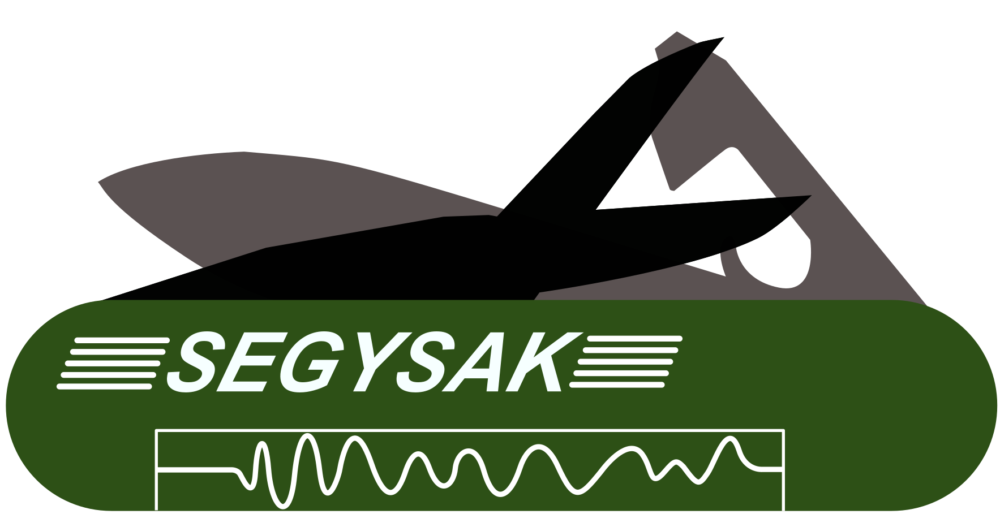

# SEGY-SAK

<div class="grid" markdown>



SEGY-SAK: A library for loading and manipulating SEG-Y data with Python using **Xarray**

</div>

**SEGY-SAK** can be use as a tool to handle *SEG-Y*
files inside Python environment.

By including  **SEGY-SAK** in your toolbox you will be
able to load or transform the original binary *SEG-Y* data into more accessible and
Python friendly formats. It leverages the work of 
[Segyio][] to simplify
loading of common SEG-Y formats into ``xarray.Dataset`` objects for ease of use and
to [NetCDF4][] files for better on disk 
and large file performance using [Dask][].
Tools to help users create new volumes and to return data to SEG-Y are also included.

## Feature

**Loading Assistance**

   * Loading of nDimensional SEG-Y data
   * Header editing
   * Loading of seismic data with missing traces

**Cube geometry functions**

  - Generate cube affine transform
  - Fill cdp_x and cdp_y

**Arbitrary slicing and extration**

  - Label based slicing
  - Arbitrary line slicing
  - Horizon extraction and sculpting
  - Well path extraction

**Integrates with the existing Python scientific stack**

  - Leverage [Xarray][] for easy coordinate management merging and plotting
  - Inherited compatibility with core Python libraries (
    [NumPy][], [Scipy][] and [Pandas][]).
  - Works well with [matplotlib][] and [Pyvista][]

 - Experimental baked in ZGY support via [PyZgy][] and Open-ZGY

**Scalability**

  - Lazy loading of SEGY data (do not load the full volume into memory) for large files.
  - NetCDF4 files work with Dask to scale your Python code to multi-core and
    distributed memory computing


## Documentation

**Getting Started**

 * Why Segysak?why-segysak`
* :doc:`installation`
* :doc:`tutorial`

.. toctree::
   :maxdepth: 1
   :hidden:
   :caption: Getting Started

   why-segysak
   installation
   examples/QuickOverview
   tutorial

**User Guide**

* :doc:`seisnc-standard`
* :doc:`examples`
* :doc:`command-line-tool`
* :doc:`faq`

.. toctree::
   :maxdepth: 1
   :caption: Contents
   :hidden:

   seisnc-standard
   examples
   command-line-tool
   faq

**Help & Reference**

* :doc:`_temp/contributing`
* :doc:`api`

.. * :doc:`related-projects`

.. toctree::
   :maxdepth: 2
   :caption: Help & reference
   :hidden:

   _temp/contributing
   api


## See also

Fundamental Python libraries to SEGY-SAK are [Segyio][] 
and [Xarray][].

Many of the examples in this documentation use a subset of the the full Volve
dataset which was published by Equinor and you can [read](https://www.equinor.com/en/news/14jun2018-disclosing-volve-data.html)
about it or get a copy of it [here](https://data.equinor.com/authenticate).


## License

Segysak use the GPL-3 license.

The GNU General Public License is a free, copyleft license for
software and other kinds of works.

## Citations

If you use this software, please cite it.

=== "APA Like"

    ```
    --8<-- "cff/apalike.txt"
    ```

=== "Bibtex"

    ```
    --8<-- "cff/bibtex.txt"
    ```
